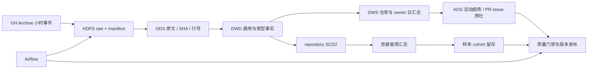

# OpenSource Pulse

**基于 Spark、Hive 与 Airflow 的开源生态离线数仓。**

[](https://github.com/royiiix-1/opensource-pulse-offline-warehouse/actions/workflows/ci.yml)

从 GitHub Archive 公开小时事件出发，构建不可变原始层与 ODS / DWD / DWS / ADS，覆盖增量调度、质量门禁、历史维度、幂等重跑和失败恢复。

## 已验证结果

| 项目 | 实测范围 |
|---|---|
| 数据 | 2024-01-01—07，168 个小时，**29,804,303 条去重事件** |
| 计算与存储 | Spark SQL on YARN；Hive 外部表；HDFS；Parquet/Snappy |
| 维度 | 2,975,375 个 repository 名称观察版本，SCD2 半开区间关联 |
| 调度 | Airflow 日增量、小时修复、日期范围参数、重试及发布门禁 |
| 正确性 | 缺小时阻断、异常隔离、独立对账、版本发布及模型重跑 NO_OP |
| 验证 | 25 项单元测试、502 项本机实时检查及原始行血缘核验 |

这是固定资源下的单机工程验证，不代表生产集群、生产 SLA 或商业收益。[证据摘要](evidence/public/portfolio.json)提供计数、性能样本及原报告摘要。

## 数据链路



- **不可变输入**：源小时、URL 与 SHA 组成输入身份；保留原始 gzip 和 manifest。
- **分层建模**：异构 payload 显式解析，事实保留来源文件、行号和事件时间；未知类型、坏行与重复记录单独审计。
- **一致性发布**：写入独立 staging，校验数据及 Hive 分区位置后再切换版本指针；失败候选不进入读取入口。
- **SCD2**：描述公开事件观察到的仓库名称变化，事实按事件时间关联历史版本；不把观察时间当作真实改名时间。

## 性能实验

固定两个 1 GiB、单核 executor；每个方案预热一次，再交替测量三轮。以下为中位数，等价查询结果一致。

| 对照 | 基线 | 对照方案 |
|---|---:|---:|
| 小维表关联 | SortMergeJoin：19.302 s | BroadcastHashJoin：14.108 s |
| 相同单小时查询 | 日级布局：0.642 s | 小时分区：0.381 s |
| 相同全日查询 | 24 个小时文件：1.048 s | 4 个压实文件：0.814 s |

压实减少文件数，但物理字节数增加；小时查询和全日查询需要不同布局。详细结果、输入字节、shuffle、重复样本及限制见 [性能报告](docs/PERFORMANCE.md)。不将本机结果外推为普遍收益。

## 快速验证

Linux / Python 3.11，无需 Hadoop 集群：

```bash
python scripts/verify_portfolio.py --mode portable
```

该入口执行单元测试、语法、文档链接和候选文件检查。GitHub Actions 运行同一入口，**CI 不替代完整数据验收**。

已配置的本地 WSL 环境可执行：

```bash
bash scripts/verify_portfolio.sh --mode full
```

完整模式校验已发布文件 SHA、Hive 表与分区、独立聚合和原始行血缘，不自动下载或重建数据。部署版本、资源要求及从零构建边界见 [运行手册](docs/RUNBOOK.md)。

## 文档

- [架构](docs/ARCHITECTURE.md) · [数据合同](docs/DATA_CONTRACTS.md) · [模型与字典](docs/DATA_MODEL.md)
- [血缘](docs/LINEAGE.md) · [设计取舍](docs/DESIGN_NOTES.md) · [故障恢复](docs/FAILURE_EXPERIMENTS.md)
- [复现说明](docs/REPRODUCIBILITY.md) · [演示](docs/DEMO.md) · [限制](docs/LIMITATIONS.md)

## 范围与许可

SCD2 仅覆盖选定样本的名称观察；owner 前缀不等于已确认组织。下一周没有数据，留存为 `IMMATURE / NULL`。日期范围接口有单测，已保存的真实范围回填实例为单日范围；七日规模通过逐日 DAG 批次构建。

仓库不包含原始归档、运行时、HDFS 数据、完整日志或逐 actor/owner 结果。源码采用 [MIT](LICENSE)，公开事件与依赖保留各自权利，见 [第三方声明](THIRD_PARTY_NOTICES.md)。
