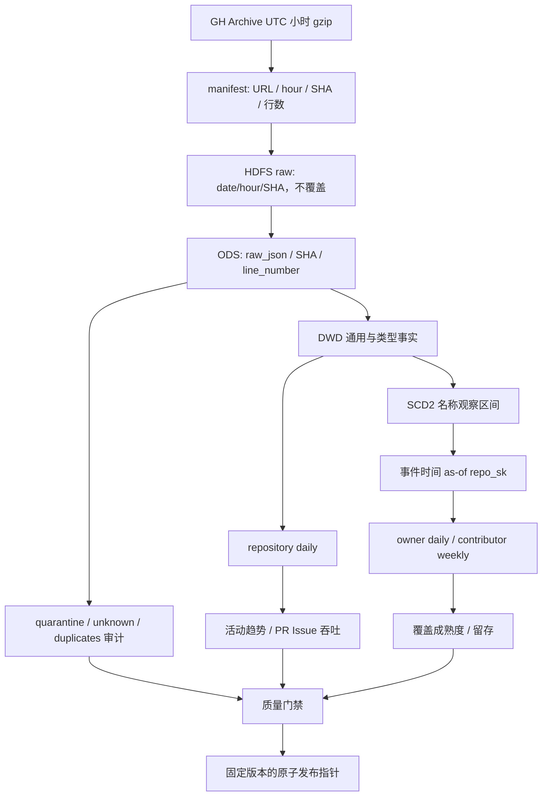

# 数据血缘与发布边界

最小回溯键为 source_sha256 + line_number，source_hour 用于分区裁剪，event_id 用于业务核对。完整验收会从已发布事实选择一个事件，查询匹配 ODS 原文的 SHA-256，再定位本地原始 gzip 中同一行核对摘要。只保存事件 ID、文件摘要、行号及行摘要，不把评论/提交原文加入候选包。

日级指针位于 build/control-v2/published/<date>.json，多日模型指针位于 build/control-m3/published.json。单个指针原子替换是提交边界；枚举 staging 或候选 Hive 数据库不等于读取已发布结果。
